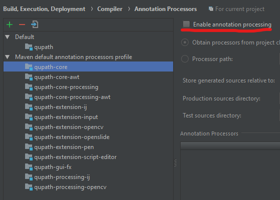
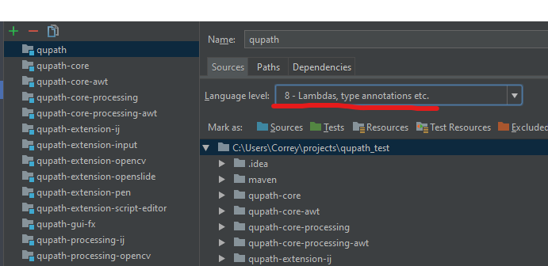
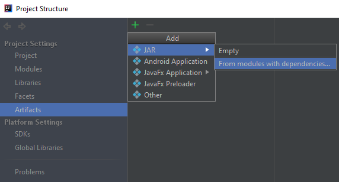
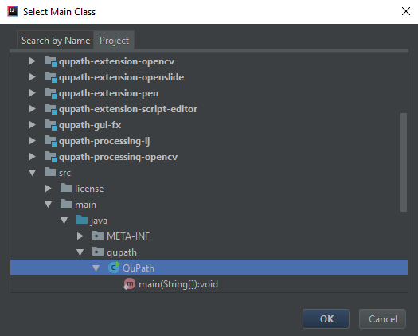
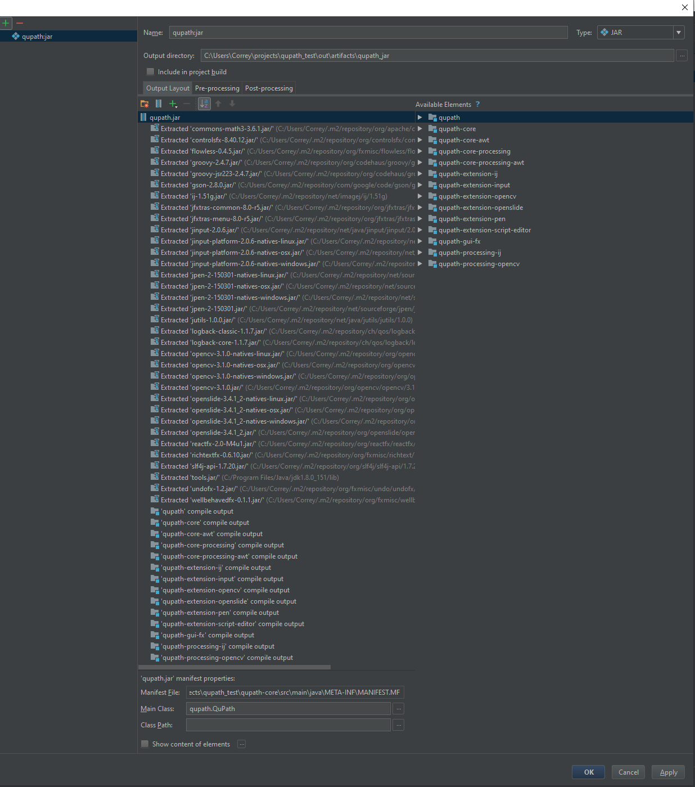
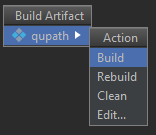

# QuPath Extension - Annotation Exchange

This extension for [QuPath](https://github.com/qupath/qupath) imports annotations made on `.svs` files using
[PaperJS](https://github.com/paperjs/paper.js) in combination with [OpenSeaDragon](https://github.com/openseadragon/openseadragon).

## Compatibility

This extension is currently only compatible with [QuPath 0.1.2](https://github.com/qupath/qupath/releases/tag/v0.1.2)

## JSON Structure

The coordinates, color, and other metadata of the annotations must be saved in a `.json` file, structured as follows:

```jsonc
{
  "SourceSlide": "name-of-file.svs",
  "dictionaries": [
    {
      "uid": "some-uid",
      "name": "some-name",
      // http://paperjs.org/reference/path/
      "path": {
          "applyMatrix": true,
          "data": {
            "id": "some-uid"
          },
          "segments": [
            // http://paperjs.org/reference/segment/#segment
            [
              [0.0, 0.0],
              [0.0, 0.0],
              [0.0, 0.0]
            ],
            // ...
          ],
          "closed": true,
          "fillColor": [0.0, 0.0, 0.0, 0.0],
          "strokeColor": [0.0, 0.0, 0.0],
          "strokeWidth": 50,
          "label": "Tumor" // (See `qupath.lib.objects.PathClass`)
      }
    }
  ]
}
```

A working example can be found below:

<details>
<summary>Full Example</summary>
<p>

```jsonc
{
  "SourceSlide": "24496.svs",
  "dictionaries": [
    [
      {
        "uid": "dc466dd0-15f7-11ea-94f7-3541d0425afc",
        "name": "dc466dd0-15f7-11ea-94f7-3541d0425afc",
        // http://paperjs.org/reference/path/
        "path": {
            "applyMatrix": true,
            "data": {
              "id": "dc466dd0-15f7-11ea-94f7-3541d0425afc"
            },
            "segments": [
              // http://paperjs.org/reference/segment/#segment
              [
                [4445.56952, 2904.39074],
                [0.9558, 6.05342],
                [-0.28748, -1.82071]
              ],
              [
                [4444.66043, 2909.84528],
                [1.02246, -1.53369],
                [-2.18812, 3.28217]
              ],
              [
                [4445.56952, 2921.66346],
                [-4.38693, -2.19347],
                [0.19696, 0.09848]
              ],
              [
                [4448.29679, 2922.57255],
                [0.00906, 0.09063],
                [-0.6098, -6.09799]
              ]
            ],
            "closed": true,
            "fillColor": [0.81569, 0.41569, 0.41569, 0.5],
            "strokeColor": [0.81569, 0.41569, 0.41569],
            "strokeWidth": 50
        }
      }
    ]
  ]
}
```

</p>
</details>

In the future, there will be efforts to remove redundant entries, and to improve the overall data structure (i.e.
transform arrays to hash-tables where it makes sense, and vice versa)

## Building the Extension

The following installations are required to build the
`AnnotationExchangeExtension.jar` artifact:

1. [Java Development Kit `8u151` (`JDK 1.8.0_151`)](https://www.oracle.com/java/technologies/javase/javase8-archive-downloads.html)
(Requires registering for an Oracle account)

2. [Intellij IDEA 2017.3.7 (Community Edition)](https://www.jetbrains.com/idea/download/other.html)

    * Linux: https://download.jetbrains.com/idea/ideaIC-2017.3.7.tar.gz
    * Windows: https://download.jetbrains.com/idea/ideaIC-2017.3.7.exe
    * MacOS: https://download.jetbrains.com/idea/ideaIC-2017.3.7.dmg

### QuPath.jar

A build of [QuPath (v0.1.2)](https://github.com/qupath/qupath/tree/v0.1.2) is
required to ensure the Java compiler does not complain about the classes
`AnnotationExchangeExtension` extends.

Previous developers have built an artifact of `QuPath.jar`, and set that as a
dependency of `AnnotationExchangeExtension`. However, you may be able to set the
`QuPath` project as a dependency of `AnnotationExchangeExtension` without making
a build of it. If you are successful in doing the latter, you can skip this
step.

1. Clone QuPath

```bash
git clone git@github.com:qupath/qupath.git
# If you do not have an SSH key from your current terminal associated with your
# GitHub account, use the https link here:
git clone https://github.com/qupath/qupath.git
# The extension currently only works for the 0.1.2 release of QuPath
# It is crucial you do this before loading the project into IntelliJ, as later
# releases of QuPath use `Gradle` as the dependency manager, whereas earlier
# releases use `Maven`, which may confuse IntelliJ regarding which dependency
# manager to use
git checkout v0.1.2
```

2. Load the project into IntelliJ

* File -> New -> Project From Existing Sources
* Choose the `qupath/` directory you just cloned
* Click the Radio button for `Import project from external model`
* Choose `Maven`
* Leave all the defaults, and keep clicking `Next` until `Finish`

3. Change the compiler settings

* File -> Settings... -> Build, Execution, Deployment -> Compiler ->
Java Compiler
* Set `Project bytecode version` to `1.8`
* For all rows in the `Per-module bytecode version` table, ensure each one
has `Target bytecode version` set to `1.8`
* Then go to Build, Execution, Deployment -> Compiler -> Annotation Processors,
and ensure that `Enable annotation processing` is not checked off for the
modules under the `Default` dropdown, as well as the
`Maven default annotation processors profile`


* File -> Project Structure... -> Modules

  For each module listed, click the `Sources` tab, and ensure each
  `Language level` dropdown option is set to
  `8 - Lambdas, type annotations etc.`



4. Add module dependencies

* File -> Project Structure... -> Modules -> Click the `qupath` module

Click the `Dependencies` tab, and add Module Dependencies:


Add all `qupath-*` modules, and check them off:


5. Build QuPath `.class` files

* You should now be able to build the project by going to Build -> Build Project
(or `Ctrl+F9`), and if there are no issues, you should see the following on the
bottom left of the `IntelliJ` window:


This means you should now be able to make `QuPath.jar`

6. Set up making `QuPath.jar`

* File -> Project Structure... -> Artifacts



Leave `Module` as `<All Modules>`.

For `Main Class`, browse your file system with the `...` button, click the
`Project` tab, and select `src/main/java/qupath/QuPath.java`



Your `Artifacts` screen should look like:



Note how all the `maven` dependencies (`.m2/repository`) are included in the
build, which `AnnotationExchangeExtension` will rely on.

Build the artifact by going to Build -> Build Artifacts... -> `qupath` -> Build



And the resulting file will be at:

`/path/to/qupath/out/artifacts/qupath/qupath.jar`

We now have the dependencies needed to build `AnnotationExchangeExtension`
